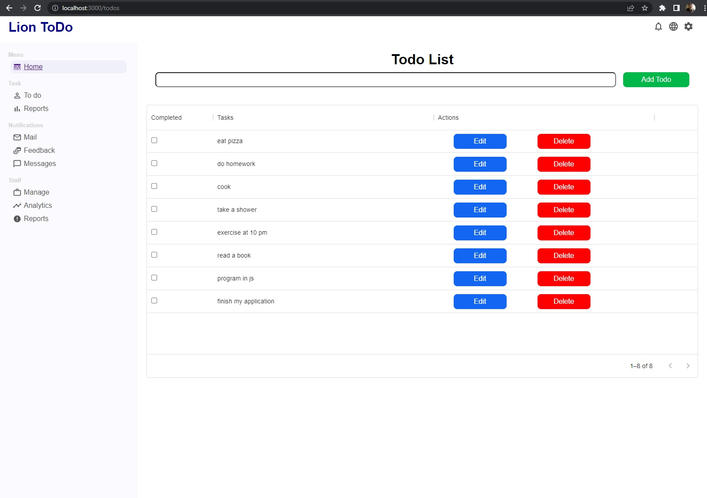

# Lion ToDo

## Description
Application that allows you to fulfill your tasks

## STACK
- HTML5
- CSS3
- JavaScript
- ReactJs
- React router dom v6
- Material ui
- SweetAlert

## Installation

Clone the project https://github.com/JesusLeonChavez/lionTodo.git

```bash
  git clone 
```

Installation

```bash
  npm i
```

Start Client

```bash
  npm start
```

## Public Routes
Accessible Routes:

* Home


* Todo


* Todo List



* Todo Data Incomplete


* Todo Edit


